# Blossom Server Architecture

This document describes the different types of Blossom servers used in nostube, how they are configured, and how they are used.

## Server Types Overview

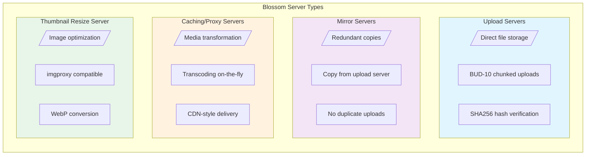

## Configuration Hierarchy

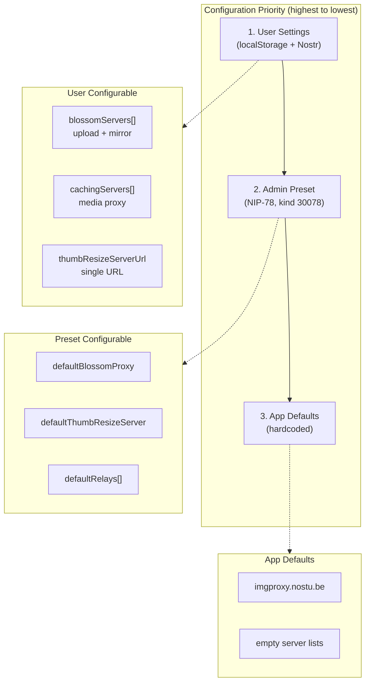

## User Configuration Flow

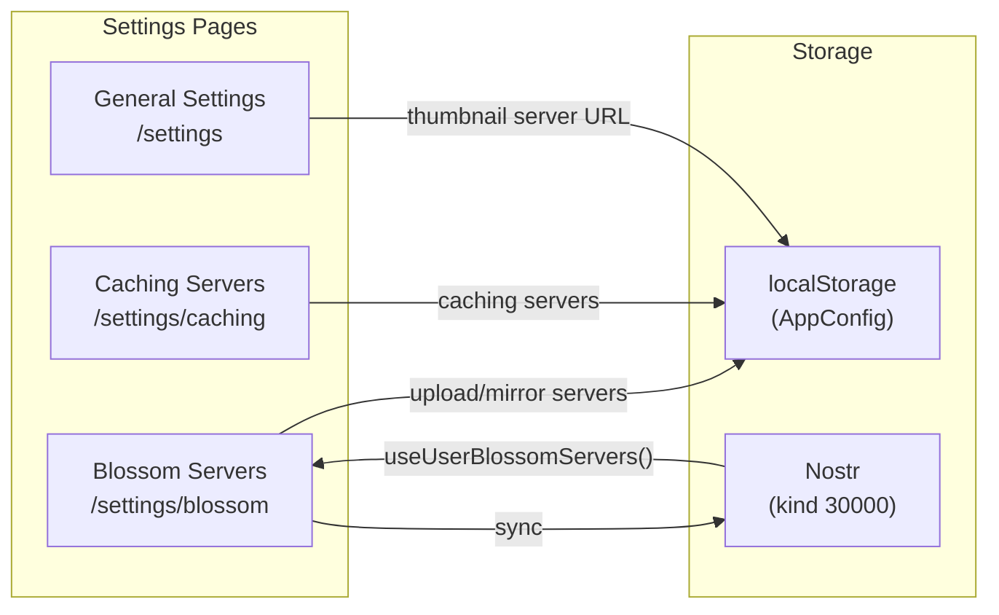

## Upload Server Flow

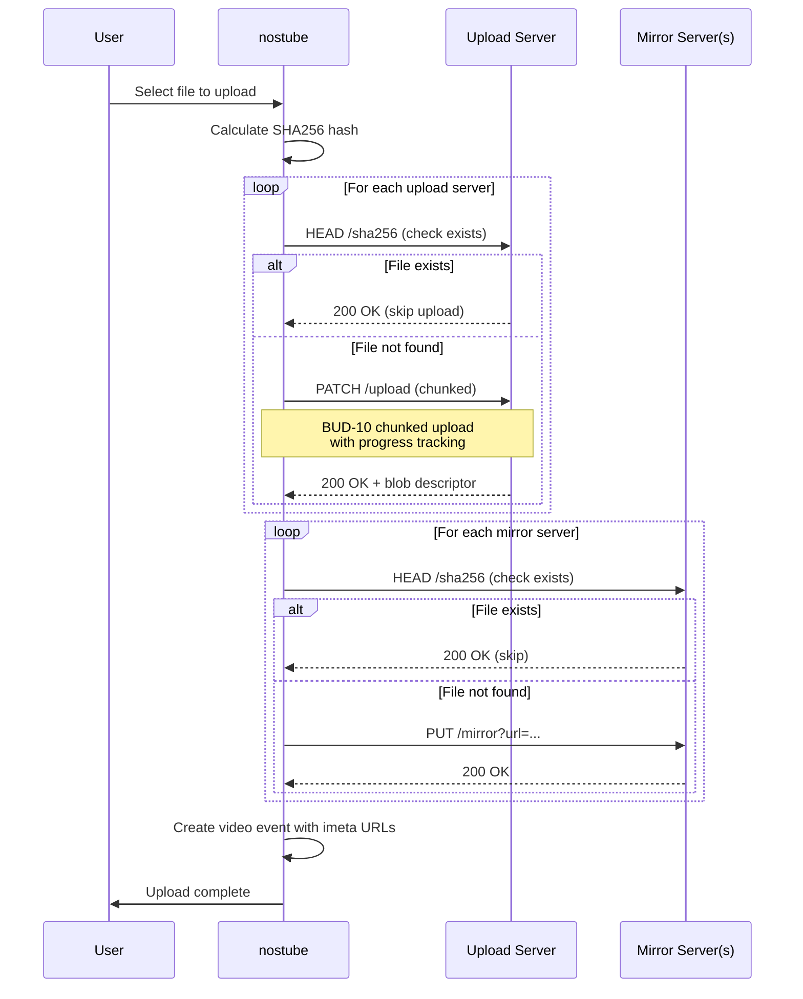

## Video Playback URL Resolution

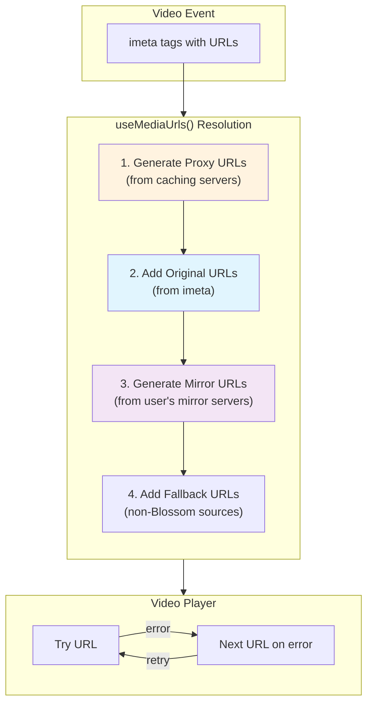

## Proxy URL Generation

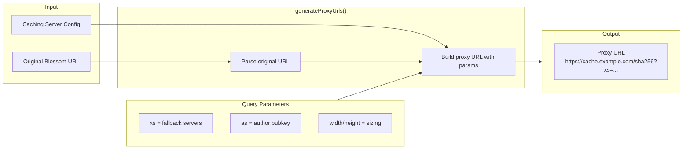

## Thumbnail Resize Flow

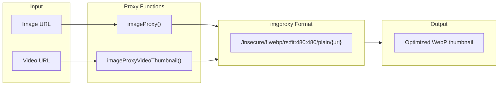

## Server Data Structures

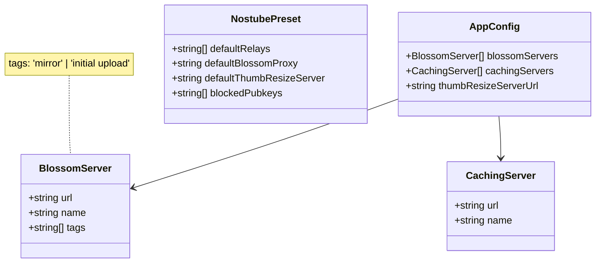

## Complete Upload to Playback Flow

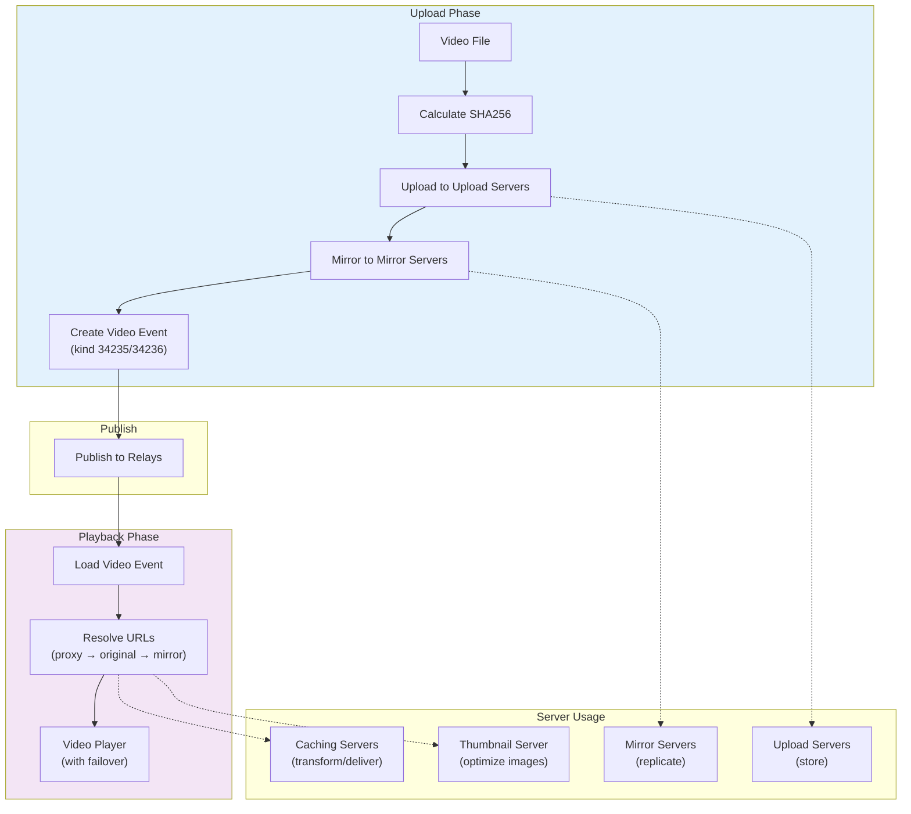

## Server Feature Comparison

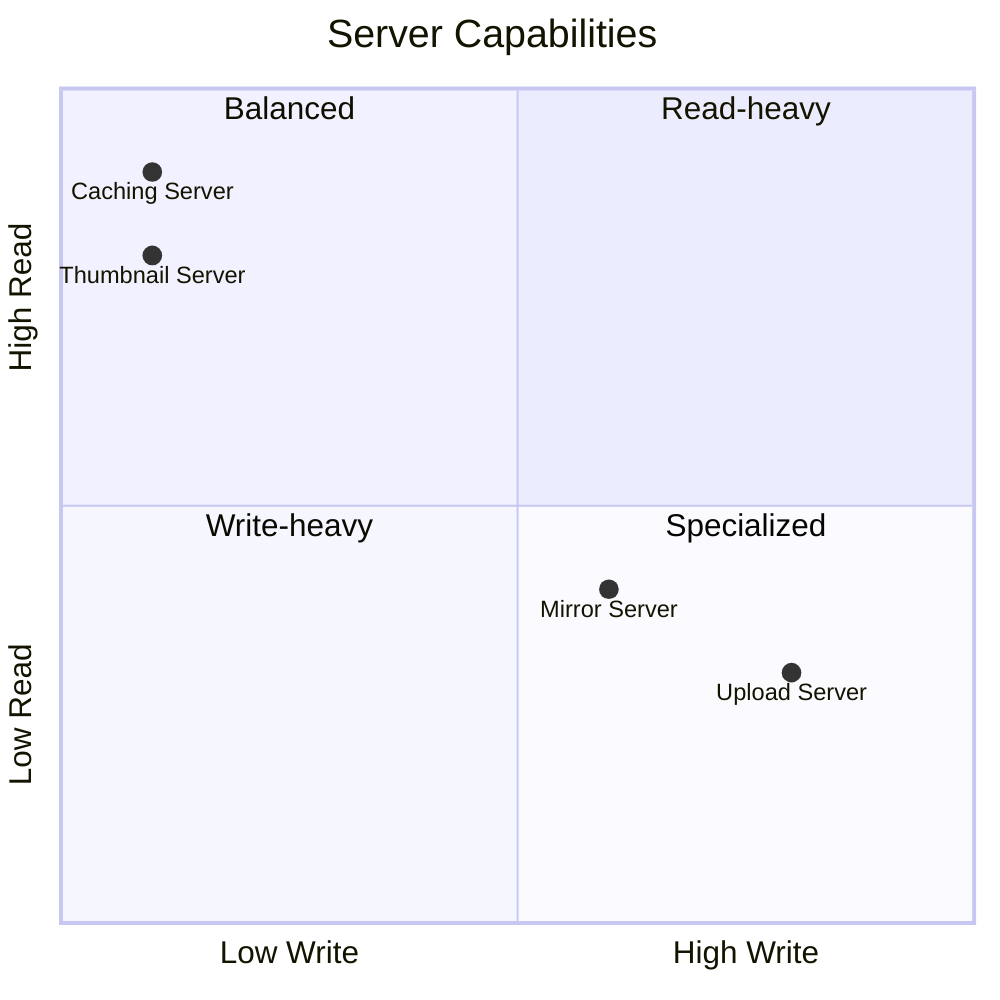

## Key Files Reference

| File                                                | Purpose                              |
| --------------------------------------------------- | ------------------------------------ |
| `src/lib/blossom-upload.ts`                         | Upload, mirror, chunked operations   |
| `src/lib/media-url-generator.ts`                    | Generate URLs with mirrors + proxies |
| `src/lib/blossom-url.ts`                            | URL detection and validation         |
| `src/hooks/useMediaUrls.ts`                         | URL failover and discovery           |
| `src/hooks/useUserBlossomServers.ts`                | Load user's servers from Nostr       |
| `src/components/settings/BlossomServersSection.tsx` | Upload/mirror server config UI       |
| `src/components/settings/CachingServersSection.tsx` | Caching server config UI             |
| `src/contexts/AppContext.ts`                        | Central config storage               |
| `src/lib/utils.ts`                                  | Image proxy functions                |

## Default Servers

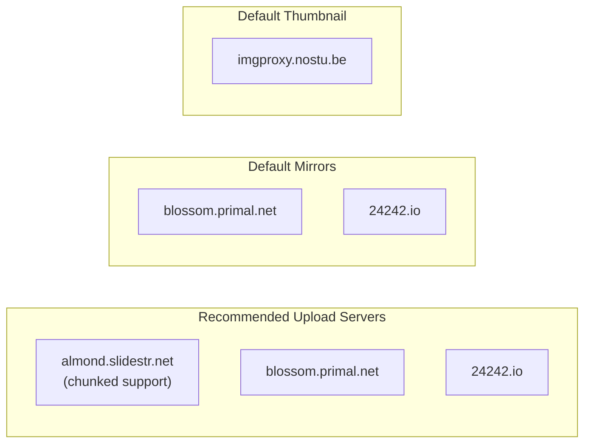
